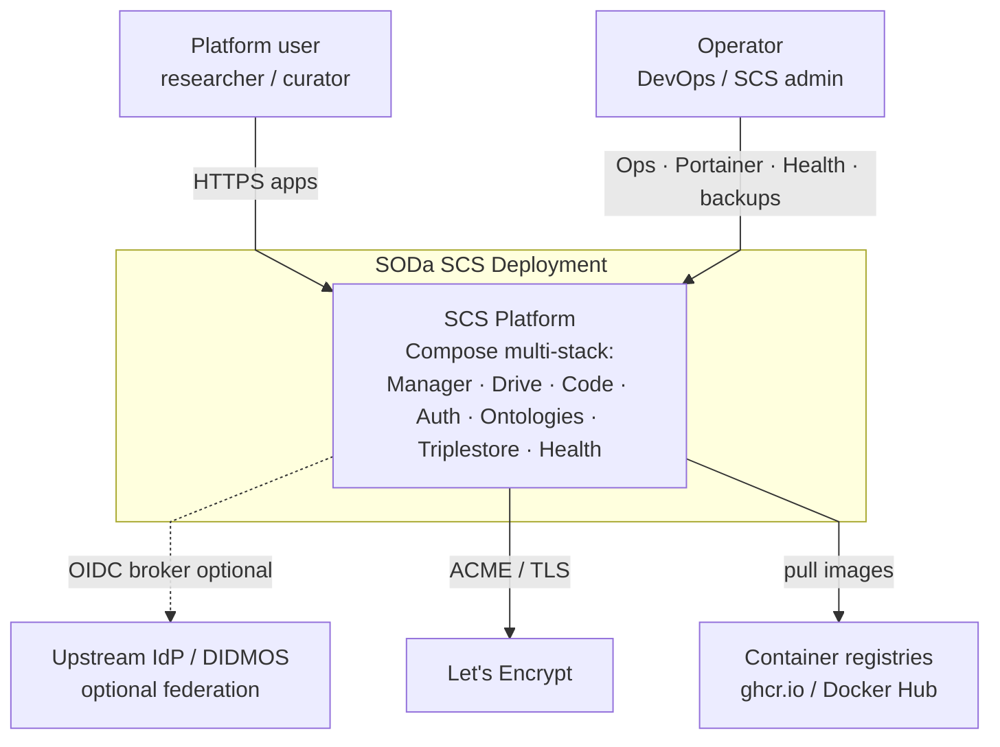
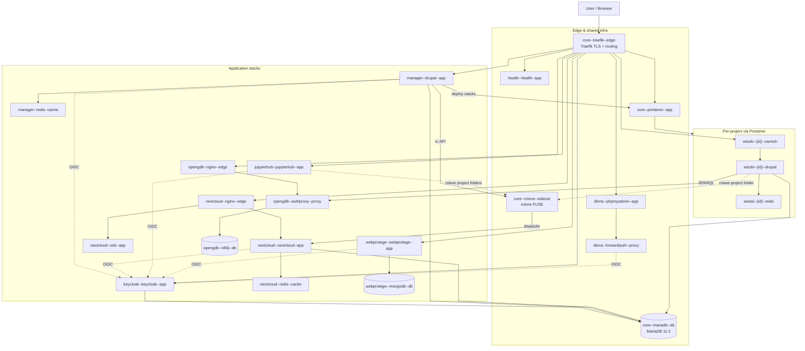
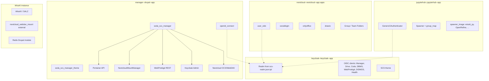
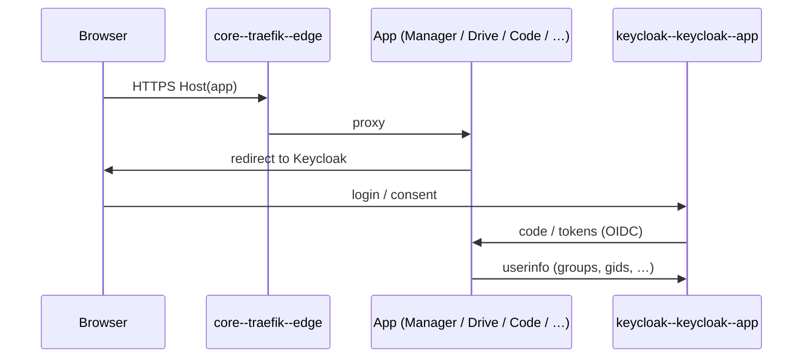
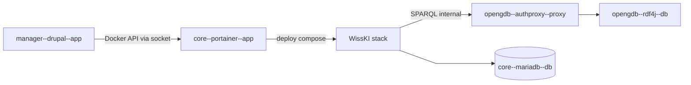
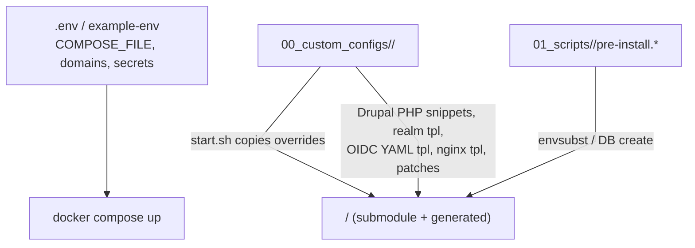
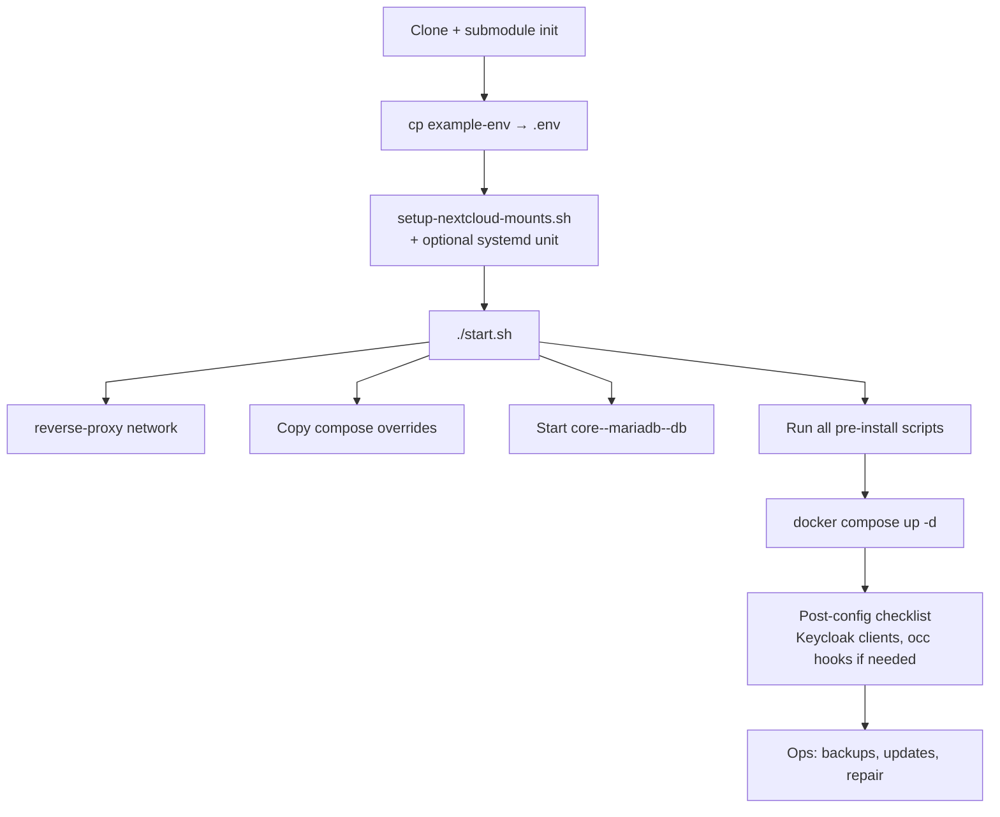

# Architecture overview (C4-style)

C4-inspired view of the **SODa SCS Manager deployment**: Compose app → Docker services → software modules → integration flows → configs and operational scripts.

**Target container DNS (migration):** `{scope}--{service}--{function}` — see **[Naming vocabulary](naming-vocabulary.md)**. Ist→Soll and cutover: [Naming migration plan](naming-migration-plan.md).

Related detail pages: [Service infrastructure](index.md), [Naming vocabulary](naming-vocabulary.md), [Naming migration plan](naming-migration-plan.md), [Nextcloud mount sidecar](nextcloud-mount-sidecar.md), [WissKI stack](wisski-stack/index.md), [Maintenance](../maintenance/index.md).

Container labels in the diagrams use the canonical DNS pattern `{scope}--{service}--{function}` (see [Naming vocabulary](naming-vocabulary.md)). Legacy aliases may still resolve during soak — cutover details: [Naming migration plan](naming-migration-plan.md).

---

## 1. System context (C4 L1)

Who uses the platform and which external systems it talks to.



---

## 2. Containers — Compose app → Docker services (C4 L2)

**Level:** one Docker Compose project (root `COMPOSE_FILE`) plus **per-project WissKI stacks** created at runtime via Portainer.



### Compose wiring (how the “App” is assembled)

| Layer | Location | Role |
|-------|----------|------|
| Root compose | `docker-compose.yml` | Traefik, MariaDB, Portainer, phpMyAdmin, forward-auth, `core--rclone--sidecar`, shared volumes/networks |
| Stack compose | `<stack>/docker-compose.yml` | Submodule base service definitions |
| Site overrides | `00_custom_configs/<stack>/docker/docker-compose.override.yml` | Domains, Traefik labels, volume mounts, networks (`!override`), ports (`!reset`) |
| Aggregation | `.env` → `COMPOSE_FILE=…` | Single `docker compose` from repo root merges all files |
| Bootstrap | `./start.sh` | Network, override copy, DB start, all `pre-install` scripts |

Never pass `-f` manually for normal ops — see project stack-operations rules.

---

## 3. Components (software modules & extensions)



| Stack | Notable modules / apps | Configured by |
|-------|------------------------|---------------|
| SCS Manager | `soda_scs_manager`, OpenID Connect, custom theme | Pre-install OIDC YAML; Drupal settings under `00_custom_configs/scs-manager-stack/drupal/` |
| Nextcloud | `user_oidc`, Social Login, OnlyOffice, Draw.io, Team Folders | `scs-nextcloud-stack/hooks/post-installation/*` (first install only) |
| JupyterHub | OAuthenticator, Linux GIDs from Keycloak groups | `jupyterhub/jupyterhub/jupyterhub_config.py` + env |
| WebProtégé | OIDC SSO, project REST API patches | `00_custom_configs/webprotege/patches/` |
| WissKI (per project) | WissKI, Redis, external Nextcloud mount | Portainer env from Manager; `wisski-base-image` |

---

## 4. Integration flows

### 4.1 Identity (OIDC)



### 4.2 Nextcloud ↔ JupyterHub / WissKI (FUSE mount)

SCS Manager owns mount lifecycle; Jupyter and WissKI only **bind** project Team Folder paths (`rslave`). Details: [Nextcloud mount sidecar](nextcloud-mount-sidecar.md).

```mermaid
%%{init: {"flowchart": {"curve": "linear"}} }%%
flowchart LR
  subgraph Host["Host FS"]
    Root["NEXTCLOUD_MOUNTS_ROOT<br/>/var/lib/scs/nextcloud-mounts<br/>propagation: shared"]
  end

  NC[nextcloud--nextcloud--app<br/>WebDAV]
  Mounter[core--rclone--sidecar<br/>rclone FUSE]
  Mgr[manager--drupal--app<br/>rc API only]
  JH[Jupyter notebook<br/>…/nextcloud/project-label]
  WK[wisski--{id}--drupal<br/>private://nextcloud]

  Mgr -->|mount/unmount| Mounter
  Mounter -->|WebDAV| NC
  Mounter -->|FUSE under user/| Root
  Root -->|rslave bind project folder| JH
  Root -->|rslave bind project folder| WK
```

### 4.3 SCS Manager ↔ Portainer ↔ WissKI



---

## 5. Where configs live



| Kind | Path | Notes |
|------|------|--------|
| Env & compose list | `.env` (from `example-env`) | `COMPOSE_FILE`, domains, DB/OIDC secrets |
| Compose overrides | `00_custom_configs/<stack>/docker/docker-compose.override.yml` | Copied by `start.sh` if dest missing |
| Drupal settings | `00_custom_configs/scs-manager-stack/drupal/*.php` | Reverse proxy, private files, OIDC, logging |
| OIDC client export | `00_custom_configs/scs-manager-stack/openid/*.yml.tpl` | → `scs-manager-stack/custom_configs/` |
| Keycloak realm | `00_custom_configs/keycloak/templates/realm/scs-realm.json.tpl` | → `keycloak/…/import/` |
| Nextcloud nginx | `00_custom_configs/scs-nextcloud-stack/…` | Proxy MIME / headers |
| phpMyAdmin | `00_custom_configs/phpmyadmin/configs/` | Sign-on / SSO |
| WebProtégé patches | `00_custom_configs/webprotege/patches/` | OIDC, project API, Docker build |
| Default landing page | `00_custom_configs/default-page/` | Optional nginx static |
| Host systemd (FUSE) | `01_scripts/global/scs-nextcloud-mounts.service` | Keeps mounts root `shared` |

Overrides use `${SCS_ROOT_PATH}/…` for host volume paths and `volumes: !override` / `networks: !override` where the base list must be replaced.

---

## 6. Bootstrap, scripts, backup & maintenance

### Lifecycle



### Script map (`01_scripts/`)

| Area | Scripts | Responsibility |
|------|---------|----------------|
| **Global bootstrap** | `global/pre-install.sh`, `setup-nextcloud-mounts.sh` | Snapshot dirs, FUSE host bind |
| **Per-stack pre-install** | `*/pre-install.sh` | DB users, realm/OIDC/VCL/nginx generation |
| **Backup orchestrator** | `global/backup-all-services.bash` | Calls all service backups → `/srv/backups/` |
| **Per-service backup** | `*-backup.bash` / `backup-*.bash` | Keycloak, Manager, Nextcloud, JupyterHub, OpenGDB, WebProtégé, project website |
| **Nextcloud maintain** | `run-nextcloud-repair.bash`, `apply-nextcloud-proxy-and-region.bash`, `configure-nextcloud-email.bash`, `fix-*.bash` | Post-update / warning fixes |
| **DB** | `database/db-snapshot.bash` | MariaDB snapshots |
| **WissKI** | `wisski/apply-performance-tuning.bash` | Tune running Portainer stacks |
| **WebProtégé** | `configure-oidc.bash` | OIDC post-setup |
| **Logs** | `global/truncate-runtime-logs.bash` | Disk hygiene |
| **Stack helpers** | `scs-nextcloud-stack/start-services.bash`, `stop-services.bash` | Start/stop Nextcloud stack alone |

Entry point for first-time setup: **`./start.sh`** at repo root. Day-2 backup: **`01_scripts/global/backup-all-services.bash`**. Updates: [Maintenance / Updates](../maintenance/updates.md).

### Docker service inventory (quick)

| Stack / compose | Containers (typical) |
|-----------------|----------------------|
| Root | `core--traefik--edge` (alias `scs--reverse-proxy`), `core--mariadb--db` (alias `scs--database`), `core--portainer--app` (alias `scs--portainer`), `dbms--phpmyadmin--app` (alias `scs--phpmyadmin`), `dbms--forwardauth--proxy` (alias `scs--forward-auth`), `core--echo--app` (alias `scs--echo`), `core--rclone--sidecar` (alias `nextcloud-mounter`) |
| Keycloak | `keycloak--keycloak--app` (alias `keycloak--keycloak`) |
| SCS Manager | `manager--drupal--app` (alias `scs-manager--drupal`), `manager--redis--cache` (alias `scs-manager--redis`) (DB/Varnish often disabled via override) |
| Nextcloud | `nextcloud--nextcloud--app` (alias `nextcloud--nextcloud`), `nextcloud--nginx--edge` (alias `nextcloud--nextcloud-reverse-proxy`), `nextcloud--ods--app` (alias `nextcloud--onlyoffice-document-server`), `nextcloud--ods--edge` (alias `nextcloud--onlyoffice-reverse-proxy`), `nextcloud--redis--cache` (alias `nextcloud--redis`) |
| JupyterHub | `jupyterhub--jupyterhub--app` (alias `jupyterhub--jupyterhub`), `jupyterhub--spawner--builder` (build only; alias `jupyterhub--image-builder`) |
| OpenGDB | `opengdb--rdf4j--db` (alias `scs--rdf4j`), `opengdb--nginx--edge` (alias `scs--opengdb-proxy`), `opengdb--authproxy--proxy` (alias `scs--authproxy`), `opengdb--outproxy--proxy` (alias `scs--outproxy`) |
| WebProtégé | `webprotege--webprotege--app` (alias `webprotege`), `webprotege--mongodb--db` (aliases `wpmongo`, `webprotege-mongodb`) |
| SCS Health | `health--health--app` (alias `scs--health`) |
| Project website (optional) | `scs-project-website--*` (not in live `COMPOSE_FILE` here; Wave H6 skipped) |
| WissKI (runtime) | `{SERVICE_NAME}--varnish` / `--drupal` / `--redis` via Portainer — **naming Wave Z deferred** (needs [wisski-base-stack](https://github.com/soda-collections-objects-data-literacy/wisski-base-stack) release; prefer `wisski--{id}--*` over `proj-{id}`) |

---

## 7. Networks & shared volumes

| Resource | Purpose |
|----------|---------|
| Network `reverse-proxy` | Traefik ↔ all public HTTP services (IPv6 enabled) |
| Network `nextcloud-mounter-net` | Internal: Manager ↔ mounter rc API only |
| Volume `scs--database-data` | Shared MariaDB |
| Volume `scs--shared-data` / `JUPYTERHUB_SHARE` | Shared Hub data |
| Host path `NEXTCLOUD_MOUNTS_ROOT` | FUSE tree for Jupyter / WissKI binds |
| Volume `scs--reverse-proxy-certificates` | Traefik / ACME storage |

---

## See also

- [Service infrastructure overview](index.md) — narrative wiring per stack  
- [Pre-start steps](../initial-setup/pre-start-steps.md) — what `start.sh` runs  
- [Post-configuration checklist](../post-configuration/checklist.md)  
- [SCS Manager user lifecycle](scs-manager-user-lifecycle.md)  
- [Troubleshooting: Drive ↔ Jupyter](../troubleshooting/scs-drive-jupyter-connection.md)
