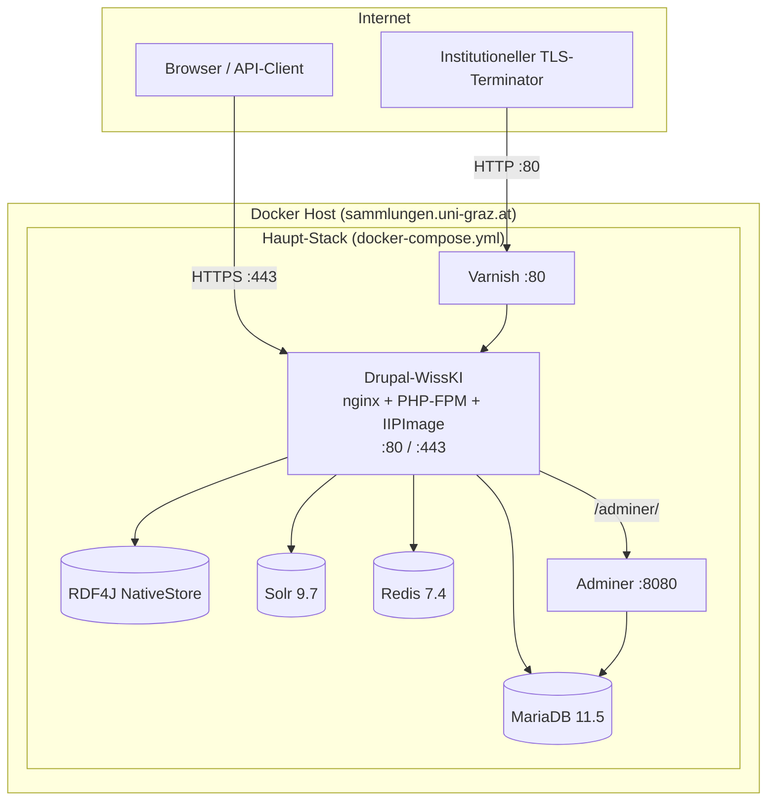

# Infrastruktur-Übersicht: Sammlungen WissKI Stack

Produktionsnahes **Docker-Compose-Deployment** für eine **WissKI**-Sammlung (Universität Graz). Zum Vergleich mit anderen Setups: alles containerisiert, mit **zwei HTTP-Einstiegspfaden** (direkt TLS vs. Varnish).

**Stand:** Juli 2026 · Repository: `/var/www/deploy/sammlungen.uni-graz.at`

---

## Architektur (Überblick)



---

## Container-Übersicht (7 Services)

| Service | Image / Build | Rolle | Host-Ports (Default) |
|---------|---------------|-------|----------------------|
| **drupal** | `drupal-wisski` (custom) | WissKI-App: nginx, PHP 8.3-FPM, IIPImage, Drush | **443** (TLS) |
| **varnish** | `varnish:7.6` | Full-Page-Cache vor Drupal | **80** (`VARNISH_PORT`) |
| **mariadb** | `mariadb:11.5` | Drupal-DB + Staging-DB `import` | `127.0.0.1:3306` |
| **rdf4j** | build `rdf4j/` | SPARQL-Triplestore (WissKI-Daten) | `127.0.0.1:8088` |
| **solr** | `solr:9.7` | Volltextsuche (Search API) | *(intern)* |
| **redis** | `redis:7.4-alpine` | Drupal-Cache + PHP-Sessions | *(intern)* |
| **adminer** | `adminer:4` | DB-UI (MariaDB) | *(nur via nginx-Proxy)* |

Container-Namenspräfix: `dockerwisski--<service>`

---

## Request-Pfade

### 1. HTTPS direkt auf Drupal (`:443`)

- TLS terminiert **im Drupal-Container** (nginx)
- Zertifikate: `./certificates/fullchain.pem` + `privkey.pem`
- ACME HTTP-01: `/.well-known/acme-challenge/` → `./letsencrypt-webroot`

### 2. HTTP über Varnish (`:80`)

- Typisch hinter institutionellem TLS-Terminator / Load Balancer
- **Varnish → Drupal nginx :80**
- `X-Forwarded-Proto: https` wird gesetzt, wenn der Upstream es nicht mitsendet

### 3. Zusatzdienste (über Drupal-nginx)

| Pfad | Ziel |
|------|------|
| `/adminer/` | Adminer (HTTP Basic Auth) |
| `/fcgi-bin/iipsrv.fcgi` | IIPImage / IIIF |

---

## Drupal / WissKI (`drupal-wisski`)

### Technologie-Stack im Container

| Komponente | Details |
|------------|---------|
| **Base** | `drupal:php8.3-fpm-bookworm` |
| **Webserver** | nginx (nicht Apache) |
| **PHP** | 8.3-FPM, APCu, Redis-Extension, OPcache (JIT), intl, GD (AVIF) |
| **CLI** | Drush 13.7 |
| **Bilder** | ImageMagick, libvips, **IIPImage** (IIIF, max 5000px) |
| **Java** | OpenJDK 17 (für WissKI-Tools) |

### PHP-Ressourcen (WissKI-tuned)

| Setting | Wert |
|---------|------|
| `memory_limit` | 1 GB |
| `max_execution_time` | 300 s |
| Upload | bis 512 MB |
| PHP-FPM `max_children` | 15 (statt Default 5) |
| OPcache | 512 MB, JIT tracing |

### Bootstrap / Erstinstallation (`entrypoint.sh`)

Beim ersten Start automatisch:

1. Drupal `site:install` (MariaDB)
2. Trusted Hosts, Private Files, Redis-Include
3. Contrib: Devel, Health Check, Redis-Modul
4. Page Cache **300 s** (für Varnish)
5. Mirador, Colorbox, DomPurify Libraries
6. IIIF-Server-URL konfigurieren
7. Optional: Nextcloud WebDAV Mount
8. PHP-FPM + IIPImage starten
9. SSL-vHost aktivieren, wenn Zertifikate vorhanden

### WissKI ↔ Triplestore (Env-Vars)

| Variable | Bedeutung |
|----------|-----------|
| `TS_READ_URL` | `http://rdf4j:8080/rdf4j-server/repositories/default` |
| `TS_WRITE_URL` | `…/repositories/default/statements` |
| `TS_REPOSITORY` | `default` (fest vorgesehen) |
| `TS_USERNAME` / `TS_PASSWORD` | RDF4J-Auth |
| `WISSKI_DEFAULT_GRAPH` | Default-Graph-URI (aus `DEFAULT_GRAPH` in `.env`) |

### Reverse-Proxy / Varnish-Kompatibilität

`configs/drupal/settings.local.php`:

- `reverse_proxy = TRUE`
- Vertraute Header: `X-Forwarded-For/Host/Port/Proto`
- Vertraute Netze: RFC1918-CIDRs (Docker-Bridge)
- `omit_vary_cookie = TRUE` (bessere Varnish-Cachebarkeit)

---

## MariaDB

| Aspekt | Konfiguration |
|--------|---------------|
| **Version** | 11.5 |
| **Haupt-DB** | `DB_NAME` (Drupal) |
| **Zusatz-DB** | `import` (XLSX-Staging, via Init-Script) |
| **Charset** | utf8mb4 / utf8mb4_unicode_ci |
| **Isolation** | READ-COMMITTED |
| **InnoDB Buffer Pool** | 512 MB (Default, via `MARIADB_INNODB_BUFFER_POOL`) |
| **Tuning** | Slow Query Log (≥2 s), max_connections=200 |
| **Persistenz** | Volume `mariadb-data` |
| **Host-Zugriff** | nur `127.0.0.1:3306` |

---

## RDF4J (Triplestore)

| Aspekt | Konfiguration |
|--------|---------------|
| **Base-Image** | `eclipse/rdf4j-workbench` (Tomcat) |
| **Repository-Typ** | `openrdf:NativeStore` (on-disk B-Trees) |
| **Repository-ID** | `default` |
| **Indizes** | `spoc`, `posc` |
| **`forceSync`** | `true` (Datensicherheit) |
| **JVM** | `-Xms256m -Xmx768m`, G1GC (Default) |
| **Container-Limit** | 1536 MB RAM |
| **Persistenz** | Volume `rdf4j-data` → `/var/rdf4j` |
| **Bootstrap** | Beim ersten Start: Repo aus `default_repository.ttl` anlegen |
| **Host-Debug-Port** | `127.0.0.1:8088 → 8080` |
| **Healthcheck** | `GET /rdf4j-server/protocol` |

**Hinweis:** NativeStore = Dateisystem-basiert, kein separater GraphDB/Blazegraph. RAM ist für Query-Bursts, nicht für die Triple-Anzahl selbst.

### Repository-Konfiguration (`rdf4j/default_repository.ttl`)

```turtle
@prefix rdfs: <http://www.w3.org/2000/01/rdf-schema#>.
@prefix config: <tag:rdf4j.org,2023:config/>.
[] a config:Repository ;
config:rep.id "default" ;
rdfs:label "The default repository" ;
config:rep.impl [
    config:rep.type "openrdf:SailRepository" ;
    config:sail.impl [
    config:sail.type "openrdf:NativeStore" ;
    config:native.tripleIndexes "spoc,posc" ;
    config:native.forceSync "true"
] .
].
```

---

## Solr

| Aspekt | Konfiguration |
|--------|---------------|
| **Version** | 9.7 |
| **JVM** | `-Xms384m -Xmx768m` (Default) |
| **Container-Limit** | 1 GB RAM |
| **Persistenz** | Volume `solr-data` |
| **Host-Port** | *(nicht exponiert — nur intern)* |
| **Zugriff** | `http://solr:8983` im Compose-Netzwerk |

Solr wird von WissKI/Drupal Search API genutzt; Core-Konfiguration erfolgt über WissKI/Drupal, nicht im Compose-File.

---

## Redis

| Aspekt | Konfiguration |
|--------|---------------|
| **Version** | 7.4-alpine |
| **Maxmemory** | 256 MB |
| **Eviction** | `allkeys-lru` |
| **Persistenz** | AOF (`appendonly yes`) + RDB-Snapshots |
| **Container-Limit** | 384 MB |

### Drupal-Nutzung (`drupal-wisski/config/redis/redis.settings.php`)

| Funktion | Details |
|----------|---------|
| **Cache-Backend** | Redis für `default`, `bootstrap`, `render`, `data`, `discovery` |
| **Form-Cache** | bleibt in MariaDB |
| **Sessions** | PHP `session.save_handler=redis`, DB **2** |
| **Session-Locking** | aktiviert (AJAX-sicher) |
| **Compression** | ab 100 Bytes, Level 1 |
| **Persistent Connections** | ja |
| **Bootstrap-Container** | Redis-beschleunigt |

---

## Varnish

| Aspekt | Konfiguration |
|--------|---------------|
| **Version** | 7.6 |
| **Cache-Size** | 192 MB (`VARNISH_SIZE`) |
| **Backend** | `drupal:80` |
| **Timeouts** | 600 s (WissKI-Entity-Views können langsam sein) |
| **Default-TTL** | 300 s (5 Min.) |
| **Grace** | 6 h |
| **Purge/BAN** | nur aus ACL (`localhost`, `drupal`) |

### Cache-Logik (Kurzfassung)

| Verhalten | Details |
|-----------|---------|
| **Gecacht** | GET/HEAD, anonym (keine Session-Cookies) |
| **Nicht gecacht** | POST/PUT/DELETE, `/admin`, `/user`, AJAX, authentifizierte Requests |
| **Statische Dateien** | Cookies entfernt |
| **ACME** | `pass` (kein Cache) |
| **Response-Header** | `X-Varnish-Cache: HIT/MISS` |
| **Drupal Page Cache** | 300 s (`system.performance cache.page.max_age`) — abgestimmt mit Varnish |

**Caching-Schichten:** Varnish (Full Page) + Redis (Drupal Object Cache) + OPcache (PHP).

---

## Persistente Volumes

| Volume | Inhalt |
|--------|--------|
| `drupal-data` | Drupal-Code, `sites/default`, Composer-Vendor |
| `private_files` | Private Uploads |
| `mariadb-data` | Drupal-DB + `import`-DB |
| `rdf4j-data` | Triplestore (NativeStore) |
| `solr-data` | Solr-Index |
| `redis-data` | Redis AOF/RDB |

---

## Netzwerk

Alle 7 Services laufen im **default**-Compose-Netzwerk. Keine externen Netzwerke im Haupt-Stack.

Adminer ist nur intern erreichbar und wird über Drupal-nginx unter `/adminer/` proxied.

---

## Ressourcen-Defaults (4-GB-Profil)

| Service | CPU Limit | RAM Limit | RAM Reservation |
|---------|-----------|-----------|-----------------|
| Drupal | 2.0 | 1 GB | 384 MB |
| MariaDB | 2.0 | 1 GB | 512 MB |
| RDF4J | 1.0 | 1536 MB | 512 MB |
| Solr | 1.0 | 1 GB | 384 MB |
| Redis | 1.0 | 384 MB | 128 MB |
| Varnish | 1.0 | 384 MB | 128 MB |
| Adminer | 0.5 | 256 MB | 64 MB |
| **Summe Reservationen** | | | **~2 GB** |

**Empfohlen für Produktion:** 8 GB RAM, 4 vCPUs.

### Skalierung auf 8 GB (Beispielwerte)

| Variable | 4 GB (Default) | 8 GB (Produktion) |
|----------|----------------|-------------------|
| `RDF4J_MEMORY_LIMIT` | 1536M | 2G |
| `RDF4J_JAVA_OPTS` | `-Xms256m -Xmx768m …` | `-Xms512m -Xmx1536m …` |
| `MARIADB_MEMORY_LIMIT` | 1G | 2G |
| `MARIADB_INNODB_BUFFER_POOL` | 512M | 1G |
| `SOLR_MEMORY_LIMIT` | 1G | 1536M |
| `SOLR_JAVA_MEM` | `-Xms384m -Xmx768m` | `-Xms512m -Xmx1g` |
| `DRUPAL_MEMORY_LIMIT` | 1G | 1536M |

---

## Wichtige Umgebungsvariablen (`.env`)

| Variable | Zweck |
|----------|-------|
| `DRUPAL_DOMAIN` | Öffentlicher Hostname |
| `DRUPAL_TRUSTED_HOSTS` | Pipe-getrennte Regex-Muster |
| `DEFAULT_GRAPH` | WissKI Default-Graph-URI |
| `VARNISH_PORT` | Host-Port für Varnish (Default: 80) |
| `PMA_AUTH_USER` / `PMA_AUTH_PASSWORD` | Basic Auth für `/adminer/` |
| `MODE` | `production` oder `development` |
| `REDIS_HOST` / `REDIS_PORT` | Redis-Verbindung für Drupal |
| `TS_*` | Triplestore-Credentials und Endpoints |

Vollständige Liste: `example-env` im Repository-Root.

---

## Vergleichs-Merkmale (Checkliste)

| Merkmal | Dieses Setup |
|---------|--------------|
| **Orchestrierung** | Docker Compose (kein K8s) |
| **CMS** | Drupal 11 + WissKI |
| **Webserver** | nginx + PHP-FPM (monolithisch im Drupal-Container) |
| **TLS** | Im App-Container (Let's Encrypt via Webroot) |
| **HTTP-Cache** | Varnish vor Drupal |
| **Object-Cache** | Redis (Drupal-Modul + PHP-Sessions) |
| **Triplestore** | RDF4J NativeStore (embedded, kein externer GraphDB) |
| **Suche** | Solr 9.7 |
| **Relationale DB** | MariaDB |
| **IIIF** | IIPImage im Drupal-Container |
| **DB-Admin** | Adminer hinter Basic Auth |
| **Skalierung** | Vertikal (VM-Ressourcen), kein horizontales Scaling |

---

## Typische Vergleichs-Szenarien

| Alternative | Unterschied zu diesem Setup |
|-------------|----------------------------|
| **Klassisches LAMP + GraphDB** | Hier: Container, RDF4J statt GraphDB, nginx statt Apache |
| **WissKI mit Blazegraph/OpenGDB** | Hier: RDF4J NativeStore, kein separater JVM-Graph-Server |
| **Drupal ohne Varnish** | Hier: expliziter Full-Page-Cache-Layer + `omit_vary_cookie` |
| **Redis nur für Cache, Sessions in DB** | Hier: Sessions auch in Redis (DB 2) |
| **Externer Solr-Cluster** | Hier: eingebetteter Solr-Container, kein ZooKeeper |
| **Traefik/nginx als separater Container** | Hier: nginx **im** Drupal-Container, Varnish separat |
| **K8s/Helm** | Hier: einfaches Compose auf einer VM |

---

## Verifikation

```bash
# Varnish → Drupal
docker compose exec -T varnish curl -sI http://localhost/

# Redis
docker compose exec -T redis redis-cli ping

# RDF4J
docker compose exec -T rdf4j curl -s http://localhost:8080/rdf4j-server/protocol

# Solr
docker compose exec -T solr curl -s http://localhost:8983/solr/admin/info/system

# Drupal
docker compose exec -T drupal drush status
```

---

## Backups

Persistente Daten liegen in Docker-Volumes:

- `drupal-data`, `private_files`, `mariadb-data`, `rdf4j-data`, `solr-data`, `redis-data`

```bash
docker volume inspect <volume-name>
```

---

## Referenzen im Repository

| Datei | Inhalt |
|-------|--------|
| `docker-compose.yml` | Service-Definitionen |
| `varnish/default.vcl` | Varnish-Cache-Logik |
| `rdf4j/default_repository.ttl` | Triplestore-Repository |
| `drupal-wisski/Dockerfile` | Custom-Image |
| `drupal-wisski/entrypoint.sh` | Erstinstallation & Bootstrap |
| `example-env` | Umgebungsvariablen-Vorlage |
| `configs/drupal/settings.local.php` | Reverse-Proxy-Einstellungen |
