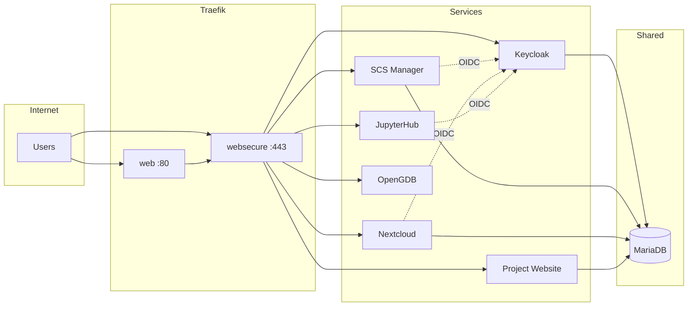

# Service infrastructure

This section describes what is in the SODa SCS Manager deployment and how the services are wired.

## Overview

The deployment is built from multiple Docker Compose files merged via the `COMPOSE_FILE` environment variable (see `example-env`). It includes:

- A **main stack** (`docker-compose.yml`): Traefik reverse proxy, shared MariaDB, Portainer, Adminer, and an access-proxy helper.
- **Submodule stacks**: SCS Manager (Drupal), Nextcloud, JupyterHub, Keycloak, OpenGDB, and the project website stack.

All services that serve HTTP or need to be reached by Traefik attach to the same Docker network, `reverse-proxy`. The shared MariaDB instance is used by Keycloak, SCS Manager, Nextcloud, and the project website; each has its own database and user created by pre-install scripts.

Keycloak is the central identity provider (IdP): SCS Manager, Nextcloud, and JupyterHub use OpenID Connect to authenticate users against Keycloak.

## Architecture diagram

## Main stack (`docker-compose.yml`)

- **scs--reverse-proxy** — Traefik: HTTP/HTTPS entrypoints, TLS (e.g. Let’s Encrypt), middlewares (HTTPS redirect, Nextcloud headers, rate limiting). Routes by `Host(...)` using Docker labels.
- **scs--database** — MariaDB. Single instance; databases and users for Keycloak, SCS Manager, Nextcloud, and project website are created by pre-install scripts.
- **scs--portainer** — Portainer CE for container management; used by SCS Manager for WissKI stack operations.
- **scs--adminer** — Adminer for database access (optional).
- **scs--access-proxy** — Helper container for file management and snapshot paths.

## Compose file aggregation

The `COMPOSE_FILE` in `example-env` lists, in order:

- Main: `docker-compose.yml`
- Stacks: `scs-manager-stack/docker-compose.yml`, `scs-nextcloud-stack/docker-compose.yml`, `jupyterhub/docker-compose.yml`, `keycloak/docker-compose.yml`, `open_gdb/docker-compose.yml`, `scs-project-website-stack/docker-compose.yml`
- Overrides: the corresponding `docker-compose.override.yml` files for each stack.

Override files are copied from `00_custom_configs/<stack>/docker/` to each stack directory by `start.sh` (see [Pre-start steps](initial-setup/pre-start-steps.md)).

## Stacks and wiring

### Traefik

- Listens on ports 80 (HTTP) and 443 (HTTPS).
- Uses Let’s Encrypt for TLS (certificate resolver `le`).
- Middlewares: `https-redirect`, `nextcloud-headers`, `rate-limit`, `rate-limit-high`, `rate-limit-strict`, and redirects (e.g. SCS Manager second domain).
- Each service that should be reachable gets Traefik labels for router rule, entrypoints, TLS, and service port.

### Database

- **scs--database** (MariaDB) is started first by `start.sh`. Pre-install scripts create:
  - Keycloak DB and user
  - SCS Manager DB and user
  - Nextcloud DB and user
  - Project website DB and user

### Keycloak

- Realm is generated from `00_custom_configs/keycloak/templates/realm/scs-realm.json.tpl` (pre-install) and imported at startup.
- Clients: JupyterHub (by `JUPYTERHUB_DOMAIN`), Nextcloud (by `NEXTCLOUD_NEXTCLOUD_DOMAIN`), SCS Manager (by `SCS_MANAGER_DOMAIN`), DIDMOS. Each has a client secret from `.env`.
- Uses the shared MariaDB for persistence.
- Exposed via Traefik on the Keycloak domain (e.g. `auth.scs.localhost`).

### SCS Manager

- Drupal application (and optionally Varnish in front). Image and mode from env (e.g. `scs-manager-image-development:latest`).
- OpenID Connect client config is generated from `00_custom_configs/scs-manager-stack/openid/openid_connect.client.scs_sso.yml.tpl` into `scs-manager-stack/custom_configs/openid_connect.client.scs_sso.yml` during pre-install. Drupal uses this for Keycloak SSO.
- Drupal settings (e.g. OpenID behaviour, reverse proxy) come from `00_custom_configs/scs-manager-stack/drupal/` (e.g. `openid-connect.settings.php`, `reverse-proxy.settings.php`).
- Varnish VCL is generated from `00_custom_configs/scs-manager-stack/varnish/default.vcl.tpl` during pre-install.
- Connects to shared MariaDB (own database).

### Nextcloud

- Nextcloud FPM, reverse proxy (nginx), Redis, OnlyOffice. Database and user created in pre-install.
- Post-installation hooks in `scs-nextcloud-stack/hooks/post-installation/` install and configure apps (e.g. Social Login, OnlyOffice, Draw.io) and trusted domains. These must be run when the stack is up (see [Post-configuration](post-configuration/checklist.md)).

### JupyterHub

- Generic OAuthenticator pointing at Keycloak (client ID, secret, authorize/token/userinfo URLs from env).
- Group and GID handling in `jupyterhub/jupyterhub/jupyterhub_config.py`: `auth_state_groups_key` reads `groups` and `gids` from the OAuth userinfo; spawner uses `group_map.json` and gids for Linux group membership in the notebook container.
- Spawner image can include tools (e.g. wisski_py, OpenRefine). JupyterHub needs the Keycloak “groups” (and optionally “gids”) scope on its client for group-based access and spawner gids to work (see [Post-configuration checklist](post-configuration/checklist.md)).

### OpenGDB

- RDF4J triplestore, AuthProxy (Django), OutProxy, nginx. Nginx config is generated from `00_custom_configs/open_gdb/opengdb_proxy/nginx.conf.tpl` during pre-install using `OPEN_GDB_DOMAIN`.

### Project website (scs-project-website-stack)

- Drupal plus Varnish and Redis. Database and user created by pre-install; Varnish VCL is generated from a template.
- **Note:** The pre-install script lives in `01_scripts/scs-project-page/` and references `00_custom_configs/scs-project-website/varnish/default.vcl.tpl` in the script, but the template file is under `00_custom_configs/scs-project-page/varnish/default.vcl.tpl`. If the script fails, use the path under `scs-project-page`. `start.sh` lists the script as `01_scripts/scs-project-website/pre-install.bash`; the actual directory is `scs-project-page`. These path/naming inconsistencies may need to be fixed in a separate change.
