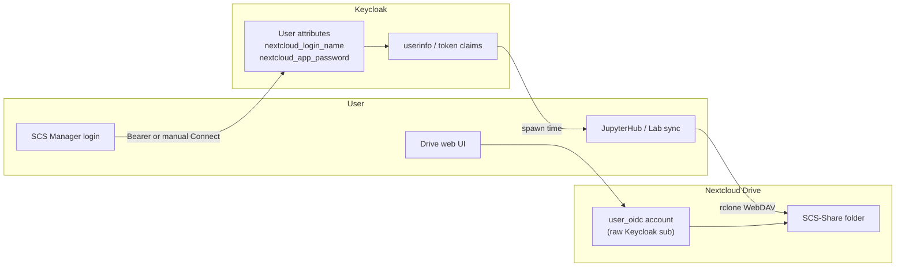

# SCS Drive ↔ Jupyter connection — renewal and troubleshooting

Runbook when Drive (Nextcloud) connection fails, SCS-Share does not sync between JupyterHub and Drive, or credentials need to be renewed. Covers **SCS Manager**, **Keycloak**, **Nextcloud**, and **JupyterHub**.

For deeper technical background see [SCS Manager user lifecycle](../service-infrastructure/scs-manager-user-lifecycle.md#4-nextcloud-credentials-in-keycloak), [Keycloak ↔ Nextcloud](../post-configuration/keycloak-nextcloud.md), and [Nextcloud Drive connection](nextcloud-drive-connect.md).

## How the connection works



| Component | Role |
|-----------|------|
| **Keycloak** | Stores `nextcloud_login_name` and `nextcloud_app_password` on the user record (written by SCS Manager). |
| **SCS Manager** | Provisions and validates those attributes (Bearer SSO or manual Connect popup). |
| **Nextcloud** | Drive account via `user_oidc`; `SCS-Share/` is the shared folder for Jupyter, WissKI, etc. |
| **JupyterHub** | At **server spawn**, copies Keycloak userinfo into `NC_LOGIN_NAME` / `NC_TOKEN` in the single-user container. Sync is **manual** (cloud icon in JupyterLab). |

**Important:** Jupyter does **not** read Keycloak on every sync — only when the single-user server is **started**. After renewing credentials, the user must **Stop → Start** the notebook server from the Hub.

## Quick reference — who does what

| Task | User | Admin |
|------|:----:|:-----:|
| Log out and back in to SCS Manager / Drive / JupyterHub | ✓ | |
| Reconnect Drive in SCS Manager (Connected Accounts) | ✓ | |
| Stop and start Jupyter server from the Hub | ✓ | |
| Cloud sync button in JupyterLab | ✓ | |
| Clear bisync cache in own notebook container | | ✓ (or user via support) |
| Fix duplicate legacy `keycloak-{sub}` Drive accounts | | ✓ |
| Set `oidcUsernamePrefix` (`{empty}` vs `keycloak-`) | | ✓ |
| `occ files:scan`, `occ user:delete`, migrate SCS-Share | | ✓ |
| Fix Keycloak audience mapper / `user_oidc` provider | | ✓ |
| Rebuild Jupyter spawner image | | ✓ |
| Restart `jupyterhub--jupyterhub`, `nextcloud--nextcloud`, `keycloak--keycloak` | | ✓ (usually **not** needed for one user) |

## Symptoms → first steps

| Symptom | Likely cause | First action |
|---------|--------------|--------------|
| SCS Manager: *Connecting Drive via SSO failed* | Bearer token rejected by Nextcloud | User: **Connect Drive manually**; Admin: check [Keycloak ↔ Nextcloud](../post-configuration/keycloak-nextcloud.md) audience / `user_oidc` |
| SCS Manager shows connected but Jupyter sync wrong/missing files | Stale Jupyter spawn or duplicate NC account | User: **Stop → Start** Jupyter server, then sync; Admin: check duplicate accounts (below) |
| Jupyter sync “succeeds”, files not in Drive UI | Jupyter syncing to **legacy** `keycloak-{sub}` account | Admin: merge accounts, delete legacy, user respawns Jupyter |
| `permission denied` on `bisync/*.lck` | Cache dir owned by root (debug `docker exec`) | Admin: `chown -R jovyan:users` on cache + SCS-Share |
| `cannot find prior Path1 or Path2 listings` | Bisync state from old NC account | User/admin: clear bisync cache (below), sync again |
| `NC_*` missing on Hub home | No valid Keycloak attributes | User: reconnect Drive in SCS Manager, respawn Jupyter |

## Users — renew the connection

Do these steps **in order** when Drive or Jupyter sync stops working.

### 1. SCS Manager — reconnect Drive

1. Log in to [SCS Manager](https://manager.scs.sammlungen.io) with Keycloak (same account as always).
2. Open **Connected Accounts** (`/user/{your-uid}/connected-accounts`) or the co-working intro Drive step.
3. If status is not connected:
   - Wait a few seconds (Bearer auto-provision may run), or
   - Click **Connect Drive manually**, sign in in the popup with the **same Keycloak account** as SCS Manager.
4. Confirm status shows connected (username should be your Keycloak `sub` UUID on this deployment, not `keycloak-…` unless your site still uses the legacy prefix).

### 2. JupyterHub — respawn the notebook server

Credentials and **project Team Folder mounts** are applied **only at spawn**.

1. Open JupyterHub → **File → Hub Control Panel** (or Hub home).
2. **Stop My Server**, then **Start My Server**.
3. Open JupyterLab → use the **cloud icon** in the file browser toolbar to sync `SCS-Share` (optional; Team Folders under `/home/jovyan/nextcloud/` come from the FUSE bind, not bisync).

Do **not** rely on only restarting the Docker container from the host — use the Hub **Stop / Start** so a new spawn picks up Keycloak userinfo and project mounts.

#### After creating or joining a project

New Team Folders are **not** hot-plugged into a running Lab. In SCS Manager:

1. Use the warning link or menu **Restart Jupyter** → confirm (warns that **unsaved notebook work will be lost**).
2. That **stops** the notebook server only.
3. Open JupyterHub → **Start My Server**.

See [Nextcloud mount sidecar — Respawn after project create / join](../service-infrastructure/nextcloud-mount-sidecar.md#respawn-after-project-create--join-not-hot).

### 3. Nextcloud Drive — refresh SSO session (if Connect popup fails)

1. Log out of Drive completely.
2. Open Drive login → **SCS SSO Login** → sign in with the same Keycloak account.
3. Retry **Connect Drive manually** in SCS Manager.

### 4. Keycloak — user session refresh

Usually fixed by logging out of SCS Manager and Drive and logging back in. Users do **not** edit Keycloak directly.

If problems persist after admin fixes, log out of all SCS services and clear site cookies for `auth.*`, `manager.*`, `drive.*`, `code.*`, then log in again.

## Admins — diagnosis and repair

### Verify the chain

Replace `{username}`, `{sub}`, `{drupal-uid}` with the affected account.

```bash
# 1. Drupal / Keycloak sub
docker compose exec -T scs-manager--drupal drush user:information {username}

# 2. Keycloak credentials (via module — no secrets printed)
docker compose exec -T scs-manager--drupal drush ev "
\$u = \Drupal\user\Entity\User::load({drupal-uid});
\$h = \Drupal::service('soda_scs_manager.nextcloud.helpers');
\$p = \Drupal::service('soda_scs_manager.project.helpers');
\$s = \$p->getUserSsoUuid(\$u);
\$c = \$h->getValidatedStoredNextcloudCredentials(\$u);
echo 'sub: ' . \$s . PHP_EOL;
echo 'expected: ' . \$h->expectedNextcloudUsernameForKeycloakId(\$s) . PHP_EOL;
echo 'stored: ' . (\$c['username'] ?? 'INVALID') . PHP_EOL;
"

# 3. Nextcloud accounts (look for duplicate keycloak-{sub} AND raw {sub})
docker exec --user www-data nextcloud--nextcloud php occ user:list | grep {sub-fragment}

# 4. Jupyter env (after user respawned)
docker inspect jupyter-{username} --format '{{range .Config.Env}}{{println .}}{{end}}' | grep ^NC_

# NC_LOGIN_NAME must equal stored nextcloud_login_name and the user_oidc Drive account id
```

### Fix duplicate legacy accounts

See [Nextcloud Drive connection — duplicate accounts](nextcloud-drive-connect.md#duplicate-nextcloud-accounts-legacy-mismatch). Summary:

1. Copy `SCS-Share` from `keycloak-{sub}` to `{sub}` if needed.
2. `occ files:scan` on the target user.
3. `occ user:delete keycloak-{sub}`.
4. User reconnects Drive and respawns Jupyter.

### Fix `oidcUsernamePrefix` mismatch

This deployment uses raw Keycloak `sub` for `user_oidc`. SCS Manager must use the `{empty}` sentinel:

```bash
docker compose exec -T scs-manager--drupal drush config:set \
  soda_scs_manager.settings nextcloud.generalSettings.oidcUsernamePrefix '{empty}' -y
```

### Jupyter bisync cache (per user)

Always run as `jovyan`, not root:

```bash
# Permission fix
docker exec jupyter-{username} chown -R jovyan:users \
  /home/jovyan/.cache/scs-nextcloud-sync /home/jovyan/SCS-Share

# Stale account / resync needed
docker exec -u jovyan jupyter-{username} rm -rf \
  /home/jovyan/.cache/scs-nextcloud-sync/bisync \
  /home/jovyan/.cache/scs-nextcloud-sync/bisync.initialized
```

Test sync:

```bash
docker exec -u jovyan jupyter-{username} python3 -c \
  "from scs_nextcloud_sync.handlers import _run_nextcloud_sync; print(_run_nextcloud_sync()['ok'])"
```

### WebDAV missing files after host-side copy

```bash
docker exec --user www-data nextcloud--nextcloud php occ files:scan \
  {sub} --path=/{sub}/files/SCS-Share
```

## What to restart (and what not to)

| Action | When | Affects |
|--------|------|---------|
| **User: Stop → Start Jupyter server** | After reconnecting Drive, or when `NC_LOGIN_NAME` is wrong | One user |
| **User: log out/in SCS Manager + Drive** | Stale OIDC token, Bearer 401 | One user |
| `docker compose restart scs-manager--drupal` | Drupal/SCS Manager code or config cache issues | All Manager users |
| `docker compose restart jupyterhub--jupyterhub` | Hub config / authenticator changes | All Hub users (running servers keep old env until respawn) |
| `docker compose restart nextcloud--nextcloud` | Nextcloud app/config changes | All Drive users |
| `docker compose restart keycloak--keycloak` | Realm/client mapper changes | All SSO users |
| Rebuild `jupyterhub--image-builder` | Spawner image / sync extension changes | New spawns only |

**Default for “connection broken for one user”:** reconnect in SCS Manager + Jupyter **respawn** — **no** stack restart required.

## Admin-only Keycloak checks

When Bearer connect fails for **all** users:

1. Nextcloud client in Keycloak has **audience** mapper so tokens include Drive client id in `aud`.
2. `user_oidc` provider: `--check-bearer=1`, `--bearer-provisioning=1` ([Keycloak ↔ Nextcloud §2.4](../post-configuration/keycloak-nextcloud.md)).
3. `config.php`: `oidc_provider_bearer_validation` = true, `bearer_validation_azp_check` = false.
4. JupyterHub client has protocol mappers for `nextcloud_login_name` and `nextcloud_app_password` (realm template).

Users never edit Keycloak Admin; admins fix realm/client configuration once.

## Related pages

- [Nextcloud Drive connection](nextcloud-drive-connect.md) — Bearer vs manual, duplicates, Jupyter bisync errors
- [SCS Manager user lifecycle](../service-infrastructure/scs-manager-user-lifecycle.md)
- [Keycloak ↔ Nextcloud](../post-configuration/keycloak-nextcloud.md)
- [JupyterHub spawn failure](jupyterhub-spawn-failure.md)
- [JupyterHub README — Nextcloud sync](../../jupyterhub/README.md)
